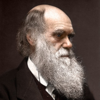
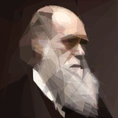
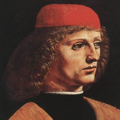
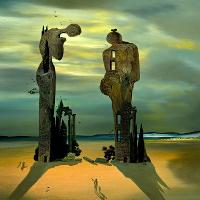
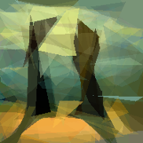
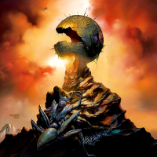
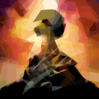

# EARP: Evolutionary Algorithm for Reproducing Pictures

EARP is a program that uses evolutionary algorithm techniques to recreate an image using a limites number of semi-transparent polygons.
The recreation image you see above has just 100 polygons in it!.

# Backstory
EARP is a spin-off from a second year University project that I felt deserved a bit more than what was on the brief.

The original project used the [DEAP library](https://deap.readthedocs.io/en/master/) and was implemented in python.
The tuning of variables and for efficiencies was calculated using this implementation but, in car parlance, there's no replacement for displacement.

So a rewrite in Golang commenced and this is what I present to you.

## Installation

### Clone the Repo
`git clone https://github.com/LukeBriggsDev/EARP`

### Fetch Dependencies
`cd EARP`
`go get`

### Build Binary
`go build`

## Usage
`earp image_path no_of_polygons no_gens`

### Example
`earp images/darwin.png 100 1000`

## Results

<iframe width="424" height="424" src="https://www.youtube.com/embed/-eObA3jZh7g" title="YouTube video player" frameborder="0" allow="accelerometer; autoplay; clipboard-write; encrypted-media; gyroscope; picture-in-picture" allowfullscreen></iframe>

Here are some results after running the algorithm for 10,000 generations (Approx. 10 minutes on an 8-core M1 Pro) and limiting solutions to less than 100 polygons.

**Generations:** 10,000

**Fitness:** 97.1%

**Generations:** 10,000

**Fitness:** 95.2%

Here is a slightly harder image that was run for 20,000 generations

**Generations:** 20,000

**Fitness:** 94.8%